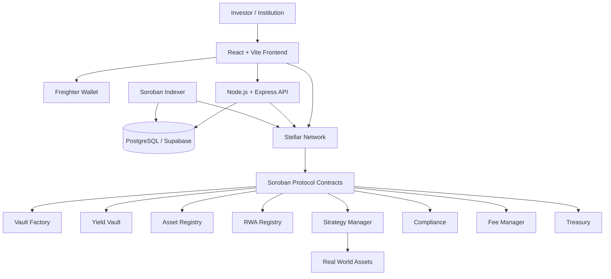

# YieldAnchor Protocol

YieldAnchor is a Stellar-native architecture for future real-world-asset (RWA) yield infrastructure. The protocol is intended to connect tokenized asset strategies with transparent Soroban contracts, an indexing and API layer, and web interfaces for investors and institutions.

This repository is currently in an architecture and scaffold phase. The structure is being prepared before production protocol features are implemented.

## Vision

YieldAnchor aims to provide a modular foundation for regulated, observable, and composable RWA yield products on Stellar. The long-term system will separate on-chain authority, off-chain indexing, application services, and user experience so each layer can be reviewed and evolved independently.

## Architecture Overview

The planned flow is:



The diagram describes the target system, not the current feature set.

## System Architecture

The long-term architecture has six authority boundaries:

1. The web application presents protocol data and prepares user actions.
2. Freighter authorizes user-controlled Stellar transactions.
3. The API provides read-oriented application services and coordinates off-chain workflows.
4. The indexer observes Soroban events and maintains queryable projections.
5. Soroban contracts enforce protocol state transitions and on-chain permissions.
6. RWA strategy integrations connect approved off-chain assets to protocol reporting and controls.

The current repository contains only an early web scaffold, two read endpoints, a polling scaffold, and one existing Soroban contract. These pieces are not production-ready.

## Smart Contract Architecture

The planned contract set is:

- `vault_factory`: creates and records vault instances.
- `yield_vault`: manages a vault's on-chain position model.
- `asset_registry`: records supported Stellar assets.
- `rwa_registry`: records approved RWA instruments and metadata references.
- `strategy_manager`: coordinates approved strategy allocation boundaries.
- `compliance`: represents eligibility and transfer restrictions.
- `fee_manager`: defines future fee policy and collection boundaries.
- `treasury`: isolates protocol-controlled treasury operations.
- `mocks`: test-only assets and dependencies.

The existing `contracts/yield_vault` crate is preserved. Its current methods are an early testnet scaffold and must not be treated as an audited vault, accounting system, yield engine, or production deployment. The other contract directories are intentionally placeholders.

## Backend Architecture

`services/api` is the planned REST API boundary. Its future modules are organized around configuration, routes, controllers, services, middleware, validators, repositories, blockchain access, compliance, analytics, and utilities.

Currently, the API exposes the existing pool statistics and transaction history routes. Their fallback data and database access are scaffold behavior only. No production authentication, authorization, accounting, compliance, analytics, or transaction execution is implemented.

## Indexer Architecture

`services/indexer` owns blockchain observation. The existing polling code now lives in `src/watcher.ts` and is started by `src/index.ts`.

The planned indexer pipeline is:

```text
Stellar RPC -> watcher -> decoder -> processor -> handlers -> repositories/checkpoints -> database
```

Decoder, processor, handlers, checkpoints, and utility modules are structural boundaries only. The current watcher retains its early polling behavior and does not provide reliable checkpointing, complete event decoding, replay guarantees, deduplication, or production projections.

## Frontend Architecture

The existing React/Vite application now lives in `apps/web`. The intended source boundaries are:

- `app`: application entry, providers, routing boundary, and configuration.
- `pages`: future route-level experiences such as landing, dashboard, vaults, portfolio, assets, transactions, compliance, settings, and admin.
- `components`: reusable UI, layout, navigation, wallet, vault, portfolio, chart, RWA, and transaction presentation components.
- `features`: future domain workflows, including wallet, deposits, withdrawals, vaults, portfolio, and compliance.
- `hooks`, `stores`, `services`, `lib`, `types`, and `styles`: shared client boundaries for later phases.

The current screen and Freighter context were moved without introducing a new router or feature workflow. The existing screen contains demo-only deposit and withdrawal controls; those controls do not submit transactions and are not an implementation of the protocol features listed in the roadmap.

## Database Architecture

`database` is the future database ownership boundary:

- `migrations`: versioned schema changes.
- `seeds`: development and test data only.
- `functions`: database-side functions when justified.
- `schema`: reviewed schema definitions and supporting documentation.

The existing migration was moved from `services/api/migrations` to `database/migrations`. It defines the current scaffold's pool snapshot and transaction log tables. It is not a complete protocol schema and does not model vault shares, RWA instruments, compliance, strategy state, NAV, reserves, or governance.

## Data Authority Model

The planned authority model is:

- Soroban contracts are authoritative for protocol state transitions and on-chain balances.
- Stellar RPC is authoritative for submitted transaction and ledger observations.
- The indexer database is a derived read model, never the source of truth for protocol state.
- The API presents validated projections and coordinates off-chain operations without silently overriding chain state.
- The frontend displays API projections and wallet state, while Freighter remains the user authorization boundary.
- RWA data providers and custodians will be authoritative only for the off-chain facts assigned to them by a future integration and control design.

This model still requires formal reconciliation, failure handling, permissions, and security review in later phases.

## Transaction Lifecycle

The planned transaction lifecycle is:

1. A user selects a future protocol action in the web application.
2. The frontend builds a transaction using a versioned contract client.
3. Freighter displays and authorizes the transaction.
4. The transaction is submitted to Stellar and confirmed through RPC.
5. Soroban contracts validate permissions and state transitions.
6. The indexer observes and decodes the resulting events.
7. The database stores a derived projection and checkpoint.
8. The API serves the projection to the frontend.

Only wallet connection and early read-oriented scaffold behavior exist today. Deposit, withdrawal, accounting, yield, and transaction execution are not complete features.

## RWA Architecture

The planned RWA boundary separates:

- asset identity and metadata in the asset and RWA registries;
- eligibility and compliance policy;
- strategy configuration and allocation permissions;
- custodial or issuer attestations;
- reporting, valuation, and reconciliation feeds;
- vault-level exposure and risk limits.

No real Treasury Bill integration, issuer integration, custodian integration, proof of reserves, NAV engine, or compliance workflow is implemented in this phase.

## Repository Structure

```text
yieldanchor/
├── apps/
│   └── web/                    # Existing React/Vite scaffold
├── services/
│   ├── api/                    # Existing Express API scaffold
│   └── indexer/                # Existing watcher under its future owner
├── contracts/
│   ├── vault_factory/          # Planned boundary
│   ├── yield_vault/            # Existing Soroban crate
│   ├── asset_registry/         # Planned boundary
│   ├── rwa_registry/           # Planned boundary
│   ├── strategy_manager/       # Planned boundary
│   ├── compliance/             # Planned boundary
│   ├── fee_manager/            # Planned boundary
│   ├── treasury/               # Planned boundary
│   └── mocks/                  # Planned test-only boundary
├── packages/
│   ├── contract-clients/
│   ├── shared-types/
│   ├── stellar-utils/
│   ├── validation/
│   └── constants/
├── database/
│   ├── migrations/
│   ├── seeds/
│   ├── functions/
│   └── schema/
├── scripts/
│   ├── deploy/
│   ├── setup/
│   ├── testnet/
│   └── utilities/
├── tests/
│   ├── contracts/
│   ├── integration/
│   ├── api/
│   └── e2e/
├── docs/
│   ├── architecture/
│   ├── contracts/
│   ├── api/
│   ├── deployment/
│   ├── security/
│   └── rwa/
├── .env.example
├── Makefile
├── Cargo.toml
├── package.json
├── pnpm-workspace.yaml
└── README.md
```

## Technology Stack

- Stellar Network and Soroban smart contracts
- Rust with `soroban-sdk` 21.x for the existing contract crate
- React, Vite, and TypeScript for the web application
- Node.js, Express, and TypeScript for the API
- Stellar RPC for blockchain observation
- PostgreSQL/Supabase as the planned derived data store
- Freighter Wallet for user authorization
- pnpm workspaces for JavaScript package boundaries

The repository currently uses the pinned dependency versions in each application and service package. Shared packages do not have runtime implementations yet.

## Development Phases

1. Architecture and repository boundaries.
2. Contract specifications, interfaces, authorization model, and tests.
3. Database schema, migrations, repositories, and indexer checkpoints.
4. Contract clients, shared types, validation, and Stellar utilities.
5. Read-only API projections and frontend navigation.
6. Vault lifecycle, share accounting, deposits, withdrawals, and transaction flows.
7. Compliance, RWA registry, strategy controls, fees, treasury, and reconciliation.
8. Security review, testnet hardening, operational controls, and deployment readiness.

Each phase should add explicit tests and documentation before dependent features are treated as available.

## Current Implementation Status

### Currently Implemented

- React/Vite application scaffold under `apps/web`.
- Freighter wallet context under `apps/web/src/components/wallet`.
- Express API scaffold under `services/api`.
- Existing read-oriented pool statistics and transaction routes.
- Existing Soroban `yield_vault` crate under `contracts/yield_vault`.
- Existing RPC polling scaffold under `services/indexer/src/watcher.ts`.
- Existing database migration moved to `database/migrations`.
- Testnet deployment script moved to `scripts/deploy`.
- Root workspace and development command boundaries.

### Architecture / Planned

- Vault factory and complete modular contract suite.
- Production vault accounting, share accounting, yield calculations, fees, and treasury logic.
- Contract clients and shared domain types.
- Reliable event decoding, processing, checkpointing, replay, and reconciliation.
- Complete API controllers, repositories, authentication, compliance, and analytics.
- Dashboard, vault explorer, portfolio, RWA, transaction, compliance, settings, and admin workflows.
- Database schema beyond the current scaffold tables.
- Real RWA/Treasury Bill integrations, proof of reserves, NAV, governance, and mainnet deployment.

## Future Roadmap

The immediate next milestone is to specify contract boundaries and data authority before adding feature code. Subsequent milestones will implement and test one vertical slice at a time, beginning with read-only contract and indexer foundations and adding transaction workflows only after their security model is documented.

No current scaffold should be used with production funds or interpreted as an investment product.

## Development Setup

Prerequisites:

- Node.js compatible with the pinned TypeScript and tooling versions.
- pnpm.
- Rust and the `wasm32-unknown-unknown` target for contract work.
- Optional: Stellar CLI for testnet contract development.
- Optional: Supabase credentials for the existing persistence scaffold.

Setup:

```bash
cp .env.example .env
pnpm install
pnpm run typecheck
```

Run individual development processes from the repository root:

```bash
pnpm run dev:web
pnpm run dev:api
pnpm run dev:indexer
```

Build the existing contract crate with `make contract-build`. Deployment is intentionally not part of the architecture phase; the script under `scripts/deploy` documents the existing testnet workflow and should be reviewed before any use.

## Contribution Guidelines

- Keep architecture boundaries explicit and preserve the authority model.
- Do not present planned modules as implemented features.
- Add tests and documentation with behavior changes.
- Keep blockchain, database, API, and frontend responsibilities separated.
- Avoid storing secrets in the repository; update `.env.example` when configuration changes.
- Treat contract, compliance, financial, and RWA changes as requiring design review before implementation.
- Prefer small, reviewable changes that preserve existing working behavior.

## License

This project is licensed under the MIT License. See [LICENSE](LICENSE).
