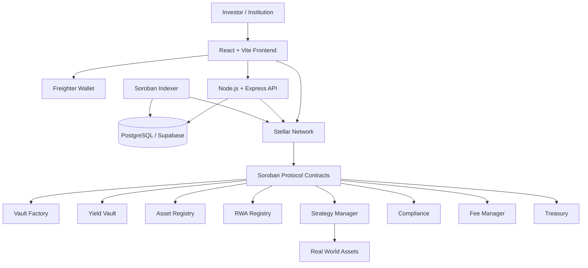

# YieldAnchor Protocol

YieldAnchor is a Stellar-native architecture for future real-world-asset (RWA) yield infrastructure. The protocol is intended to connect tokenized asset strategies with transparent Soroban contracts, an indexing and API layer, and web interfaces for investors and institutions.

This repository has completed Phase 0 architecture work, the Phase 1 core YieldVault contract, the Phase 2 database projection and indexer checkpointing, and the Phase 3 shared-package boundaries (contract clients, shared types, validation, Stellar utilities, constants). Phase 1's yield is a deterministic Testnet-only simulation; it is not real Treasury Bill/RWA yield and must not be used with production funds.

## Vision

YieldAnchor aims to provide a modular foundation for regulated, observable, and composable RWA yield products on Stellar. The long-term system will separate on-chain authority, off-chain indexing, application services, and user experience so each layer can be reviewed and evolved independently.

## Architecture Overview

The planned flow is:



The diagram describes the target system, not the current feature set.

## System Architecture

The long-term architecture has six authority boundaries:

1. The web application presents protocol data and prepares user actions.
2. Freighter authorizes user-controlled Stellar transactions.
3. The API provides read-oriented application services and coordinates off-chain workflows.
4. The indexer observes Soroban events and maintains queryable projections.
5. Soroban contracts enforce protocol state transitions and on-chain permissions.
6. RWA strategy integrations connect approved off-chain assets to protocol reporting and controls.

Phase 1 adds the core YieldVault contract while preserving the Phase 0 web, API, indexer, and repository architecture. The application layers remain early scaffolds and are not production-ready.

## Smart Contract Architecture

The planned contract set is:

- `vault_factory`: creates and records vault instances.
- `yield_vault`: manages a vault's on-chain position model.
- `asset_registry`: records supported Stellar assets.
- `rwa_registry`: records approved RWA instruments and metadata references.
- `strategy_manager`: coordinates approved strategy allocation boundaries.
- `compliance`: represents eligibility and transfer restrictions.
- `fee_manager`: defines future fee policy and collection boundaries.
- `treasury`: isolates protocol-controlled treasury operations.
- `mocks`: test-only assets and dependencies.

The `contracts/yield_vault` crate now contains the Phase 1 core vault: asset-agnostic deposits, shares, redemption, withdrawals, checked integer accounting, pause controls, authorization, events, read-only views, and deterministic ledger-time simulation. The simulated yield is explicitly Testnet-only and is not an audited vault, real yield engine, Treasury Bill integration, RWA integration, oracle, strategy, NAV calculation, or production deployment. The other contract directories remain intentionally empty placeholders.

## Shared Package Architecture

`packages` holds the boundaries every other workspace depends on. Dependencies point one way, so there are no cycles:

```text
constants -> shared-types -> stellar-utils -> validation -> contract-clients
```

- `@yieldanchor/constants`: network passphrases and endpoints, the contract's event topics, the `VaultError` code map, the protocol parameters (including the simulated-yield denominators), database table and column names, and the indexer's ingestion defaults. It has no runtime dependencies. Its tests read `contracts/yield_vault/src/lib.rs` and fail if a topic, error code, or parameter drifts from the contract.
- `@yieldanchor/shared-types`: the vault config/state/metadata types, decoded event types, database row shapes, and API DTOs. Amounts are `bigint` in the domain and decimal strings at transport boundaries, because `i128` does not survive a JavaScript `number` or a JSON encoder.
- `@yieldanchor/stellar-utils`: exact integer helpers (`toNumericString`, `fromNumericString`, `toSafeNumber`, `mulDivTrunc`), base-unit/amount formatting, checksum-based address validation, defensive `ScVal` decoding, and ledger-time estimation.
- `@yieldanchor/validation`: Zod schemas for account and contract addresses, base-unit and decimal amounts, the vault's entry-point inputs, and the indexer's environment configuration. Environment parsing reports problems and falls back to documented defaults rather than throwing, so a malformed `.env` cannot stop a service from booting.
- `@yieldanchor/contract-clients`: `YieldVaultClient`, with simulated read-only calls decoded into shared types, transaction builders that return unsigned assembled transactions, and a sign-and-send path that takes an injected `signTransaction` function (the shape Freighter exposes). No secret key is read, stored, or accepted anywhere in this package.

Each package is TypeScript, compiled to `dist/` by `tsc`. Consumers resolve the compiled declarations, so `pnpm run build:packages` runs first in the `typecheck`, `test`, and `build` scripts. The client is library-only in Phase 3: nothing in `apps/` or `services/` submits a transaction yet.

## Backend Architecture

`services/api` is the planned REST API boundary. Its future modules are organized around configuration, routes, controllers, services, middleware, validators, repositories, blockchain access, compliance, analytics, and utilities.

Currently, the API exposes the existing pool statistics and transaction history routes. Their fallback data and database access are scaffold behavior only. No production authentication, authorization, accounting, compliance, analytics, or transaction execution is implemented.

## Indexer Architecture

`services/indexer` owns blockchain observation. The polling code lives in `src/watcher.ts` and is started by `src/index.ts`.

The pipeline is:

```text
Stellar RPC -> watcher -> decoder -> repositories/checkpoints -> database
```

Phase 2 implements the observation and persistence path:

- `decoder.ts` decodes the Phase 1 contract's events into typed rows and ignores anything that is not a recognised vault event.
- `checkpoints/checkpoint-store.ts` persists the RPC cursor, so the poller resumes after a restart instead of restarting from `now`.
- `repositories/vault-repository.ts` upserts vault metadata and appends decoded events, deduplicating on the Soroban event id so a replay is idempotent.
- `config.ts` reads the RPC, contract, and Supabase configuration.

Set `INDEXER_START_LEDGER` to a non-negative safe integer to backfill retained events on a cold start, for example the ledger containing the vault's deployment. A stored checkpoint always takes precedence, even if the configured ledger is older or newer; this option never rewinds a running projection. When the value is unset or invalid, the watcher uses the current ledger tip. Invalid values are reported, and startup logs identify the chosen source: checkpoint, configured ledger, or tip.

The RPC provider must still retain the requested events (Testnet commonly retains roughly seven days). Setting an old ledger does not recover expired events; choose a ledger within the provider's retention window. Start from the initialization ledger when available so vault metadata can be projected. This option does not erase checkpoints or automatically re-project existing rows.

Still planned: a separate processor/handler split, reconciliation, and stronger replay guarantees. The watcher also retains a scaffold-only `pool_snapshots` write that the existing API route and dashboard still consume; replacing it with real vault state requires contract state reads (Phase 5).

## Frontend Architecture

The existing React/Vite application now lives in `apps/web`. The intended source boundaries are:

- `app`: application entry, providers, routing boundary, and configuration.
- `pages`: future route-level experiences such as landing, dashboard, vaults, portfolio, assets, transactions, compliance, settings, and admin.
- `components`: reusable UI, layout, navigation, wallet, vault, portfolio, chart, RWA, and transaction presentation components.
- `features`: future domain workflows, including wallet, deposits, withdrawals, vaults, portfolio, and compliance.
- `hooks`, `stores`, `services`, `lib`, `types`, and `styles`: shared client boundaries for later phases.

The current screen and Freighter context were moved without introducing a new router or feature workflow. The existing screen contains demo-only deposit and withdrawal controls; those controls do not submit transactions and are not an implementation of the protocol features listed in the roadmap.

## Database Architecture

`database` owns the derived read model:

- `migrations`: versioned schema changes. `002_create_protocol_tables.sql` adds the Phase 2 `vaults`, `vault_events`, and `indexer_checkpoints` tables.
- `seeds`: development and test data only.
- `functions`: database-side functions when justified.
- `schema`: reviewed schema definitions and supporting documentation — see `database/schema/README.md`.

`001_create_tables.sql` holds the scaffold's pool snapshot and transaction log tables, which the existing API routes and dashboard still use. The schema remains incomplete: it does not model vault shares as a stored projection (they are derived from `vault_events`), RWA instruments, compliance, strategy state, NAV, reserves, or governance.

Amounts are stored as `numeric(40,0)` because the contract accounts in `i128` base units. Queries cast those columns to `text` so a 128-bit amount is never coerced into a lossy JavaScript number.

## Data Authority Model

The planned authority model is:

- Soroban contracts are authoritative for protocol state transitions and on-chain balances.
- Stellar RPC is authoritative for submitted transaction and ledger observations.
- The indexer database is a derived read model, never the source of truth for protocol state.
- The API presents validated projections and coordinates off-chain operations without silently overriding chain state.
- The frontend displays API projections and wallet state, while Freighter remains the user authorization boundary.
- RWA data providers and custodians will be authoritative only for the off-chain facts assigned to them by a future integration and control design.

This model still requires formal reconciliation, failure handling, permissions, and security review in later phases.

## Transaction Lifecycle

The planned transaction lifecycle is:

1. A user selects a future protocol action in the web application.
2. The frontend builds a transaction using a versioned contract client.
3. Freighter displays and authorizes the transaction.
4. The transaction is submitted to Stellar and confirmed through RPC.
5. Soroban contracts validate permissions and state transitions.
6. The indexer observes and decodes the resulting events.
7. The database stores a derived projection and checkpoint.
8. The API serves the projection to the frontend.

The frontend still contains only wallet connection and early read-oriented scaffold behavior. It does not integrate the Phase 1 contract or implement production deposit, withdrawal, accounting, yield, or transaction-execution workflows.

## RWA Architecture

The planned RWA boundary separates:

- asset identity and metadata in the asset and RWA registries;
- eligibility and compliance policy;
- strategy configuration and allocation permissions;
- custodial or issuer attestations;
- reporting, valuation, and reconciliation feeds;
- vault-level exposure and risk limits.

No real Treasury Bill integration, issuer integration, custodian integration, proof of reserves, NAV engine, or compliance workflow is implemented in this phase.

## Repository Structure

```text
yieldanchor/
├── apps/
│   └── web/                    # Existing React/Vite scaffold
├── services/
│   ├── api/                    # Existing Express API scaffold
│   └── indexer/                # Existing watcher under its future owner
├── contracts/
│   ├── vault_factory/          # Planned boundary
│   ├── yield_vault/            # Existing Soroban crate
│   ├── asset_registry/         # Planned boundary
│   ├── rwa_registry/           # Planned boundary
│   ├── strategy_manager/       # Planned boundary
│   ├── compliance/             # Planned boundary
│   ├── fee_manager/            # Planned boundary
│   ├── treasury/               # Planned boundary
│   └── mocks/                  # Planned test-only boundary
├── packages/                   # Shared boundaries (Phase 3)
│   ├── constants/              # Networks, event topics, error codes, table names
│   ├── shared-types/           # Vault, event, row and DTO types
│   ├── stellar-utils/          # Integer, amount, address, ScVal and ledger helpers
│   ├── validation/             # Zod input and environment schemas
│   └── contract-clients/       # Typed YieldVault client
├── database/
│   ├── migrations/
│   ├── seeds/
│   ├── functions/
│   └── schema/
├── scripts/
│   ├── deploy/
│   ├── setup/
│   ├── testnet/
│   └── utilities/
├── tests/
│   ├── contracts/
│   ├── integration/
│   ├── api/
│   └── e2e/
├── docs/
│   ├── architecture/
│   ├── contracts/
│   ├── api/
│   ├── deployment/
│   ├── security/
│   └── rwa/
├── .env.example
├── .prettierignore
├── .prettierrc.json
├── Cargo.lock                  # pinned Soroban contract dependency graph
├── Cargo.toml                  # Rust workspace root (contracts only)
├── Makefile                    # Rust/Soroban automation only
├── eslint.config.mjs           # ESLint flat config for TS/JS
├── package.json                # pnpm workspace scripts
├── pnpm-workspace.yaml
├── tsconfig.base.json          # Shared TypeScript base config
└── README.md
```

## Technology Stack

- Stellar Network and Soroban smart contracts
- Rust with `soroban-sdk` 21.x for the existing contract crate
- React, Vite, and TypeScript for the web application
- Node.js, Express, and TypeScript for the API
- Stellar RPC for blockchain observation
- PostgreSQL/Supabase as the derived data store for the Phase 2 projection
- Freighter Wallet for user authorization
- pnpm workspaces for JavaScript package boundaries
- ESLint (flat config, TypeScript support) and Prettier for the TypeScript/JavaScript workspaces
- Zod for the shared validation schemas in `packages/validation`
- Vitest for the `packages/*`, `services/api`, and `services/indexer` unit tests; Rust tests run through `cargo test`
- rustfmt and clippy for Rust; Prettier never formats Rust sources

The repository currently uses the pinned dependency versions in each package. The five shared packages under `packages/` now have runtime implementations; each app and service consumes the compiled `dist/` output, so `pnpm run build:packages` runs before typechecking, testing, or building them.

## Development Phases

1. Architecture and repository boundaries (Phase 0 complete).
2. Core YieldVault contract, integer accounting, authorization, pause controls, simulated Testnet yield, and unit tests (Phase 1 complete).
3. Database schema, migrations, repositories, and indexer checkpoints (Phase 2 complete).
4. Contract clients, shared types, validation, and Stellar utilities (Phase 3 complete).
5. Read-only API projections and frontend navigation.
6. Vault lifecycle, share accounting, deposits, withdrawals, and transaction flows.
7. Compliance, RWA registry, strategy controls, fees, treasury, and reconciliation.
8. Security review, testnet hardening, operational controls, and deployment readiness.

Each phase should add explicit tests and documentation before dependent features are treated as available.

## Current Implementation Status

### Currently Implemented

- React/Vite application scaffold under `apps/web`.
- Freighter wallet context under `apps/web/src/components/wallet`.
- Express API scaffold under `services/api`.
- Existing read-oriented pool statistics and transaction routes.
- Phase 1 Soroban `yield_vault` contract under `contracts/yield_vault`, including unit tests and Testnet-only simulated yield.
- Indexer path under `services/indexer`: event decoder, cursor checkpoint store, and write repositories, all unit tested. The watcher resumes from its stored checkpoint and deduplicates replayed events.
- Phase 2 database projection under `database/migrations/002_create_protocol_tables.sql` (`vaults`, `vault_events`, `indexer_checkpoints`), documented in `database/schema/README.md`.
- Read repositories for the vault projection under `services/api/src/repositories`. These are the data-access boundary only; they are not yet wired to routes.
- Phase 3 shared packages under `packages/`: protocol constants, shared domain and database types, Stellar/Soroban utilities, Zod validation schemas, and a typed YieldVault contract client. Each is unit tested, and `@yieldanchor/constants` checks its event topics, error codes and parameters against the contract's source.
- Vitest test runners in every JavaScript workspace, run by `pnpm test` alongside the contract tests.
- Existing database migration moved to `database/migrations`.
- Testnet deployment script moved to `scripts/deploy`.
- Root workspace and development command boundaries.

### Architecture / Planned

- Vault factory and complete modular contract suite.
- Production yield sources, RWA/Treasury Bill integrations, and production vault accounting beyond the Phase 1 simulation.
- A dedicated indexer processor/handler split, reconciliation, and stronger replay guarantees.
- Wiring the contract client and the read repositories into API routes and frontend flows (Phases 5 and 6).
- API controllers, authentication, compliance, analytics, and wiring the Phase 2 read repositories to routes.
- Dashboard, vault explorer, portfolio, RWA, transaction, compliance, settings, and admin workflows.
- Database schema beyond the Phase 2 vault projection (RWA, compliance, strategy, NAV, reserves).
- Real RWA/Treasury Bill integrations, proof of reserves, NAV, governance, and mainnet deployment.

## Future Roadmap

Phase 1 establishes and tests the core YieldVault boundary with a clearly labeled Testnet-only yield simulation, Phase 2 adds the database projection and indexer checkpointing that observe it, and Phase 3 adds the shared boundaries the rest of the stack builds on: protocol constants, shared types, Stellar utilities, validation, and a typed contract client. The next milestone is wiring those boundaries into read-only API projections and frontend navigation; the vault is not yet integrated into any application workflow. Production yield, RWA/Treasury Bill integrations, and dependent features require separate design, security review, and later phases.

No current scaffold should be used with production funds or interpreted as an investment product.

## Development Setup

Prerequisites:

- Node.js `>=20` and pnpm (the workspace pins `pnpm@9.15.0` through `packageManager`).
- Rust and the `wasm32-unknown-unknown` target for contract work.
- Optional: Stellar CLI for Testnet contract development.
- Optional: Supabase credentials for the existing persistence scaffold.

Setup:

```bash
cp .env.example .env
pnpm install
pnpm run typecheck
```

The daily workflow is driven by `pnpm` from the repository root. `pnpm run` lists every
available script.

```bash
pnpm run build         # compile packages/*, then bundle apps/web and compile the services
pnpm run build:packages # compile only packages/* (run this before typechecking a consumer)
pnpm run typecheck     # compile packages/*, then tsc --noEmit in every workspace
pnpm run test          # compile packages/*, then vitest in every JS workspace, then the contract tests
pnpm run test:packages # vitest for packages/* only
pnpm --filter @yieldanchor/indexer test:watch   # vitest in watch mode, one workspace at a time
pnpm run lint          # ESLint over the TypeScript/JavaScript workspaces
pnpm run format        # Prettier write
pnpm run format:check  # Prettier check (use in CI)
```

Consumers import the packages' compiled output, so `pnpm run typecheck`, `pnpm run test`
and `pnpm run build` all compile `packages/*` first. Running a single workspace's
`typecheck` before the packages have ever been built will fail to resolve
`@yieldanchor/*`; build the packages once and then iterate inside the workspace.

The service test suites are unit tests. They use stubbed Supabase and RPC clients rather
than a live database or network, so `pnpm run test` needs no credentials and no reachable
Testnet.

Run individual development processes from the repository root:

```bash
pnpm run dev:web
pnpm run dev:api
pnpm run dev:indexer
```

### Command mapping

The former Makefile wrapped pnpm and contained no Rust automation, so its commands
now live in `package.json`. The Makefile is retained only for Rust/Soroban targets.

| Old command           | New equivalent                                       |
| --------------------- | ---------------------------------------------------- |
| `make install`        | `pnpm install`                                       |
| `make build`          | `pnpm run build`                                     |
| `make typecheck`      | `pnpm run typecheck`                                 |
| `make dev-web`        | `pnpm run dev:web`                                   |
| `make dev-api`        | `pnpm run dev:api`                                   |
| `make dev-indexer`    | `pnpm run dev:indexer`                               |
| `make contract-build` | `pnpm run contract:build` (or `make contract-build`) |

### Rust and Soroban

The contract crate remains Rust + Soroban/Wasm under `contracts/`; it was not
migrated to TypeScript. The repository root is the Cargo workspace root, so
`target/` and `Cargo.lock` belong there and `[profile.release]` must be declared in
the root `Cargo.toml` — Cargo ignores that table when it appears in a workspace
member.

`make help` lists the Rust-only targets, which are equivalent to the `contract:*`
scripts in `package.json`:

```bash
make contract-build       # cargo build --release --target wasm32-unknown-unknown
make contract-check       # cargo check -p yield_vault
make contract-test        # cargo test -p yield_vault
make contract-fmt         # cargo fmt --all
make contract-fmt-check   # cargo fmt --all -- --check
make contract-clippy      # cargo clippy -p yield_vault --all-targets -- -D warnings
make clean                # cargo clean
```

Rust formatting and linting are owned by rustfmt and clippy; Prettier and ESLint do
not format or lint `contracts/`.

### Testnet deployment

Two equivalent paths deploy the same wasm. Both are Testnet-only development aids
and neither is production-ready.

```bash
pnpm run contract:deploy:ts   # TypeScript, through @yieldanchor/contract-clients
pnpm run contract:deploy      # shell script, requires the stellar CLI on PATH
```

The TypeScript path is preferred: it builds the packages, deploys through the same
client the indexer and API use, initializes the vault, and verifies the result by
reading it back. It generates a funded deployer on first use and keeps the key in
`scripts/.deployer.json` (gitignored); inject `DEPLOYER_SECRET` instead in CI. Both
paths record the outcome in `scripts/.contract_id`, and the shell path additionally
refuses an underlying asset that is a Stellar account (`G...`) rather than a token
contract (`C...`).

A live smoke test then exercises the deployed vault end to end against real Testnet
state:

```bash
pnpm run testnet:round-trip   # deposit, yield accrual, redemption
```

`scripts/` is type-checked by its own `tsconfig.json` rather than compiled as a
workspace, so `pnpm run typecheck` covers it alongside the packages and services. See
`docs/deployment/testnet.md` for the current deployment, what that round trip
reported, and the Phase 1 limitations it exposes.

## Contribution Guidelines

- Keep architecture boundaries explicit and preserve the authority model.
- Do not present planned modules as implemented features.
- Add tests and documentation with behavior changes.
- Keep blockchain, database, API, and frontend responsibilities separated.
- Avoid storing secrets in the repository; update `.env.example` when configuration changes.
- Treat contract, compliance, financial, and RWA changes as requiring design review before implementation.
- Prefer small, reviewable changes that preserve existing working behavior.
- Before opening a change, run `pnpm run lint`, `pnpm run format:check`, and
  `pnpm run typecheck`, plus the Rust checks (`make contract-fmt-check`,
  `make contract-clippy`, `make contract-test`) when contracts are touched.

## License

This project is licensed under the MIT License. See [LICENSE](LICENSE).
